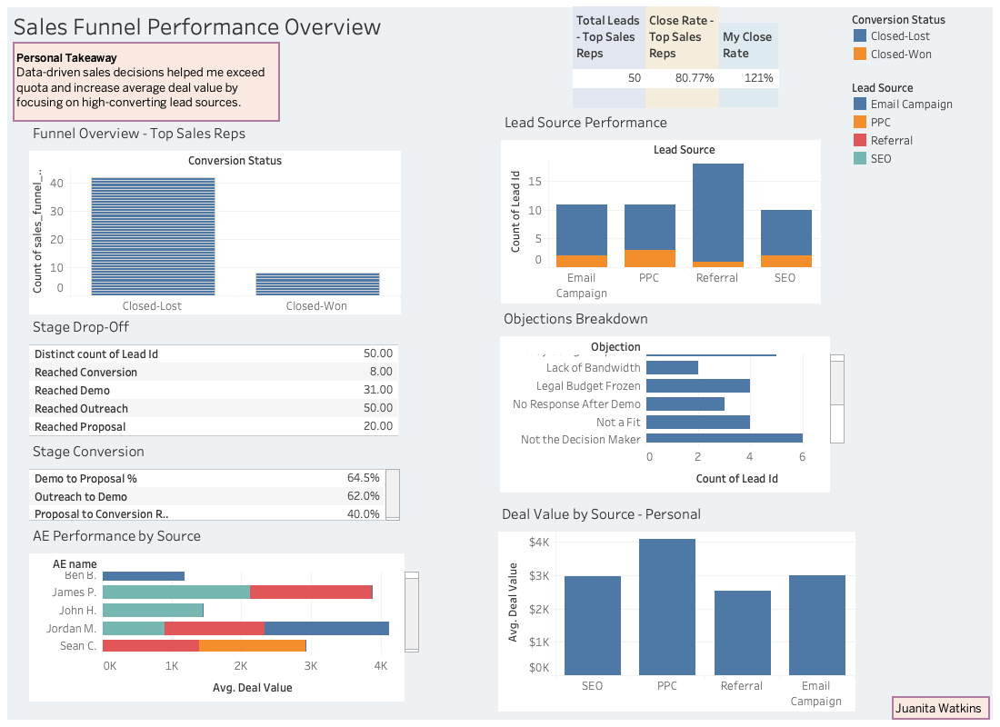

# Sales Funnel Case Study

**Objective:**  
Built a robust sales pipeline by analyzing CRM and Outreach.io data to identify high-performing lead trends — exceeding time-bound quarterly quota goals.

---

## Project Overview

This case study examines sales performance trends across an SDR team, focusing on:
- Funnel stage drop-offs
- Lead source quality
- Objection handling
- Personal close rate vs. team average
- Deal value trends across sources and reps

---

## Dashboard Preview

---

## Deliverables

| Item                         | Link / File |
|------------------------------|-------------|
| **Interactive Tableau Workbook** | `Sales_Funnel_Performance.twbx` |
| **Case Study Slides (PDF)**      | `Sales_Funnel_Case_Study.pdf`   |
| **Source CSVs** (Optional)       | `Lead Data.csv`, `Lead Data with Deal Values.csv`, etc. |

---

## Tools Used

- **Tableau** — dashboard & insights
- **Excel / Google Sheets** — data transformation
- **Canva** — case study visuals
- **GitHub** — project hosting

---

## Key Learnings

- Used outreach data to spot lead source performance gaps
- Discovered objection patterns that impacted close rate
- Generated personal deal values above team average by refining pitch strategy
- Built dynamic Tableau dashboard and case study for stakeholders

---

## Outcome

Final dashboard and presentation designed to give sales leaders clear, data-backed recommendations on how to exceed quota through better targeting and funnel strategy.
